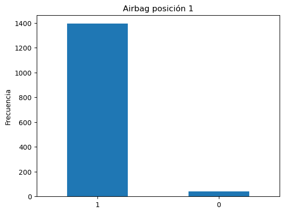
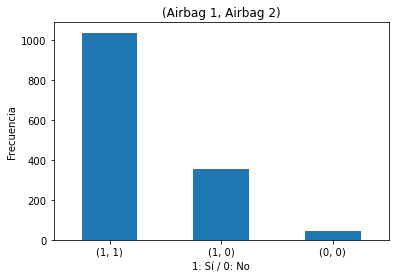
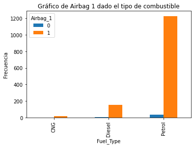
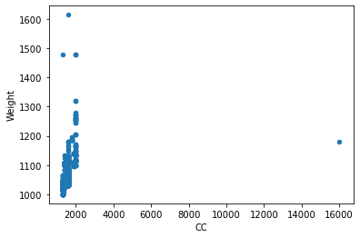

# Uso de Pandas

Librería para manipulación/análisis de datos. https://pandas.pydata.org/


> (c) 2019 Galit Shmueli, Peter C. Bruce, Peter Gedeck - Data Minign for Business Analytics

Cuando importamos módulos o paquetes se suele usar "biding notation" o alias para hacer el código más fácil de leer. 
```
import <package> as <alias>
```
Los alias `np`, `pd`, and `plt` son usados comúnmente en la comunidad de data science.


```python
# importamos los paquetes necesarios para usarlos en este notebook
import pandas as pd
import numpy as np
```

## Carga de datos en nuestro entorno de Python

Trabajaremos con Toyota Corolla dataset

** Debemos asegurarnos sobre la ubicación del dataset que queremos cargar. Aquí se asume que el dataset está ubicado en el mismo folder que este notebook


```python
toyota_df = pd.read_csv('ToyotaCorolla.csv')
```

Usamos shape para conocer el número de filas y columnas de nuestro dataset


```python
toyota_df.shape
```


    (1436, 39)


Iniciamos la exploración del dataset desplegando algunas de las primeras observaciones 


```python
toyota_df.head(10)  #por default head() imprime las 5 primeras filas del dataset
```


<div>
<style scoped>
    .dataframe tbody tr th:only-of-type {
        vertical-align: middle;
    }

    .dataframe tbody tr th {
        vertical-align: top;
    }

    .dataframe thead th {
        text-align: right;
    }
</style>
<table border="1" class="dataframe">
  <thead>
    <tr style="text-align: right;">
      <th></th>
      <th>Id</th>
      <th>Model</th>
      <th>Price</th>
      <th>Age_08_04</th>
      <th>Mfg_Month</th>
      <th>Mfg_Year</th>
      <th>KM</th>
      <th>Fuel_Type</th>
      <th>HP</th>
      <th>Met_Color</th>
      <th>...</th>
      <th>Powered_Windows</th>
      <th>Power_Steering</th>
      <th>Radio</th>
      <th>Mistlamps</th>
      <th>Sport_Model</th>
      <th>Backseat_Divider</th>
      <th>Metallic_Rim</th>
      <th>Radio cassette</th>
      <th>Parking Assistant</th>
      <th>Tow Bar</th>
    </tr>
  </thead>
  <tbody>
    <tr>
      <th>0</th>
      <td>1</td>
      <td>TOYOTA Corolla 2.0 D4D HATCHB TERRA 2/3-Doors</td>
      <td>13500</td>
      <td>23</td>
      <td>10</td>
      <td>2002</td>
      <td>46986</td>
      <td>Diesel</td>
      <td>90</td>
      <td>1</td>
      <td>...</td>
      <td>1</td>
      <td>1</td>
      <td>0</td>
      <td>0</td>
      <td>0</td>
      <td>1</td>
      <td>0</td>
      <td>0</td>
      <td>0</td>
      <td>0</td>
    </tr>
    <tr>
      <th>1</th>
      <td>2</td>
      <td>TOYOTA Corolla 2.0 D4D HATCHB TERRA 2/3-Doors</td>
      <td>13750</td>
      <td>23</td>
      <td>10</td>
      <td>2002</td>
      <td>72937</td>
      <td>Diesel</td>
      <td>90</td>
      <td>1</td>
      <td>...</td>
      <td>0</td>
      <td>1</td>
      <td>0</td>
      <td>0</td>
      <td>0</td>
      <td>1</td>
      <td>0</td>
      <td>0</td>
      <td>0</td>
      <td>0</td>
    </tr>
    <tr>
      <th>2</th>
      <td>3</td>
      <td>TOYOTA Corolla 2.0 D4D HATCHB TERRA 2/3-Doors</td>
      <td>13950</td>
      <td>24</td>
      <td>9</td>
      <td>2002</td>
      <td>41711</td>
      <td>Diesel</td>
      <td>90</td>
      <td>1</td>
      <td>...</td>
      <td>0</td>
      <td>1</td>
      <td>0</td>
      <td>0</td>
      <td>0</td>
      <td>1</td>
      <td>0</td>
      <td>0</td>
      <td>0</td>
      <td>0</td>
    </tr>
    <tr>
      <th>3</th>
      <td>4</td>
      <td>TOYOTA Corolla 2.0 D4D HATCHB TERRA 2/3-Doors</td>
      <td>14950</td>
      <td>26</td>
      <td>7</td>
      <td>2002</td>
      <td>48000</td>
      <td>Diesel</td>
      <td>90</td>
      <td>0</td>
      <td>...</td>
      <td>0</td>
      <td>1</td>
      <td>0</td>
      <td>0</td>
      <td>0</td>
      <td>1</td>
      <td>0</td>
      <td>0</td>
      <td>0</td>
      <td>0</td>
    </tr>
    <tr>
      <th>4</th>
      <td>5</td>
      <td>TOYOTA Corolla 2.0 D4D HATCHB SOL 2/3-Doors</td>
      <td>13750</td>
      <td>30</td>
      <td>3</td>
      <td>2002</td>
      <td>38500</td>
      <td>Diesel</td>
      <td>90</td>
      <td>0</td>
      <td>...</td>
      <td>1</td>
      <td>1</td>
      <td>0</td>
      <td>1</td>
      <td>0</td>
      <td>1</td>
      <td>0</td>
      <td>0</td>
      <td>0</td>
      <td>0</td>
    </tr>
    <tr>
      <th>5</th>
      <td>6</td>
      <td>TOYOTA Corolla 2.0 D4D HATCHB SOL 2/3-Doors</td>
      <td>12950</td>
      <td>32</td>
      <td>1</td>
      <td>2002</td>
      <td>61000</td>
      <td>Diesel</td>
      <td>90</td>
      <td>0</td>
      <td>...</td>
      <td>1</td>
      <td>1</td>
      <td>0</td>
      <td>1</td>
      <td>0</td>
      <td>1</td>
      <td>0</td>
      <td>0</td>
      <td>0</td>
      <td>0</td>
    </tr>
    <tr>
      <th>6</th>
      <td>7</td>
      <td>TOYOTA Corolla 2.0 D4D 90 3DR TERRA 2/3-Doors</td>
      <td>16900</td>
      <td>27</td>
      <td>6</td>
      <td>2002</td>
      <td>94612</td>
      <td>Diesel</td>
      <td>90</td>
      <td>1</td>
      <td>...</td>
      <td>1</td>
      <td>1</td>
      <td>0</td>
      <td>0</td>
      <td>1</td>
      <td>1</td>
      <td>0</td>
      <td>0</td>
      <td>0</td>
      <td>0</td>
    </tr>
    <tr>
      <th>7</th>
      <td>8</td>
      <td>TOYOTA Corolla 2.0 D4D 90 3DR TERRA 2/3-Doors</td>
      <td>18600</td>
      <td>30</td>
      <td>3</td>
      <td>2002</td>
      <td>75889</td>
      <td>Diesel</td>
      <td>90</td>
      <td>1</td>
      <td>...</td>
      <td>1</td>
      <td>1</td>
      <td>0</td>
      <td>0</td>
      <td>0</td>
      <td>1</td>
      <td>0</td>
      <td>0</td>
      <td>0</td>
      <td>0</td>
    </tr>
    <tr>
      <th>8</th>
      <td>9</td>
      <td>TOYOTA Corolla 1800 T SPORT VVT I 2/3-Doors</td>
      <td>21500</td>
      <td>27</td>
      <td>6</td>
      <td>2002</td>
      <td>19700</td>
      <td>Petrol</td>
      <td>192</td>
      <td>0</td>
      <td>...</td>
      <td>1</td>
      <td>1</td>
      <td>1</td>
      <td>0</td>
      <td>0</td>
      <td>0</td>
      <td>1</td>
      <td>1</td>
      <td>0</td>
      <td>0</td>
    </tr>
    <tr>
      <th>9</th>
      <td>10</td>
      <td>TOYOTA Corolla 1.9 D HATCHB TERRA 2/3-Doors</td>
      <td>12950</td>
      <td>23</td>
      <td>10</td>
      <td>2002</td>
      <td>71138</td>
      <td>Diesel</td>
      <td>69</td>
      <td>0</td>
      <td>...</td>
      <td>0</td>
      <td>1</td>
      <td>0</td>
      <td>0</td>
      <td>0</td>
      <td>1</td>
      <td>0</td>
      <td>0</td>
      <td>0</td>
      <td>0</td>
    </tr>
  </tbody>
</table>
<p>10 rows × 39 columns</p>
</div>


```python
toyota_df.tail(2)
```


<div>
<style scoped>
    .dataframe tbody tr th:only-of-type {
        vertical-align: middle;
    }

    .dataframe tbody tr th {
        vertical-align: top;
    }

    .dataframe thead th {
        text-align: right;
    }
</style>
<table border="1" class="dataframe">
  <thead>
    <tr style="text-align: right;">
      <th></th>
      <th>Id</th>
      <th>Model</th>
      <th>Price</th>
      <th>Age_08_04</th>
      <th>Mfg_Month</th>
      <th>Mfg_Year</th>
      <th>KM</th>
      <th>Fuel_Type</th>
      <th>HP</th>
      <th>Met_Color</th>
      <th>...</th>
      <th>Powered_Windows</th>
      <th>Power_Steering</th>
      <th>Radio</th>
      <th>Mistlamps</th>
      <th>Sport_Model</th>
      <th>Backseat_Divider</th>
      <th>Metallic_Rim</th>
      <th>Radio cassette</th>
      <th>Parking Assistant</th>
      <th>Tow Bar</th>
    </tr>
  </thead>
  <tbody>
    <tr>
      <th>1434</th>
      <td>1441</td>
      <td>TOYOTA Corolla 1.3 16V HATCHB LINEA TERRA 2/3-...</td>
      <td>7250</td>
      <td>70</td>
      <td>11</td>
      <td>1998</td>
      <td>16916</td>
      <td>Petrol</td>
      <td>86</td>
      <td>1</td>
      <td>...</td>
      <td>0</td>
      <td>0</td>
      <td>0</td>
      <td>0</td>
      <td>0</td>
      <td>1</td>
      <td>0</td>
      <td>0</td>
      <td>0</td>
      <td>0</td>
    </tr>
    <tr>
      <th>1435</th>
      <td>1442</td>
      <td>TOYOTA Corolla 1.6 LB LINEA TERRA 4/5-Doors</td>
      <td>6950</td>
      <td>76</td>
      <td>5</td>
      <td>1998</td>
      <td>1</td>
      <td>Petrol</td>
      <td>110</td>
      <td>0</td>
      <td>...</td>
      <td>0</td>
      <td>1</td>
      <td>0</td>
      <td>0</td>
      <td>0</td>
      <td>0</td>
      <td>0</td>
      <td>0</td>
      <td>0</td>
      <td>0</td>
    </tr>
  </tbody>
</table>
<p>2 rows × 39 columns</p>
</div>


## Limpieza o Preprocesamiento
La preparación, limpieza o preprocesamiento de datos es una de las tareas principales del análisis de datos.

Mostremos los nombres de las columnas.


```python
toyota_df.columns
```


    Index(['Id', 'Model', 'Price', 'Age_08_04', 'Mfg_Month', 'Mfg_Year', 'KM',
           'Fuel_Type', 'HP', 'Met_Color', 'Color', 'Automatic', 'CC', 'Doors',
           'Cylinders', 'Gears', 'Quarterly_Tax', 'Weight', 'Mfr_Guarantee',
           'BOVAG_Guarantee', 'Guarantee_Period', 'ABS', 'Airbag_1', 'Airbag_2',
           'Airco', 'Automatic_airco', 'Boardcomputer', 'CD_Player',
           'Central_Lock', 'Powered_Windows', 'Power_Steering', 'Radio',
           'Mistlamps', 'Sport_Model', 'Backseat_Divider', 'Metallic_Rim',
           'Radio cassette', 'Parking Assistant', 'Tow Bar'],
          dtype='object')


Fíjese en el nombre de algunas de las columnas, donde el nombre consta de dos palabras separadas por un espacio en blanco. Para un análisis posterior esto podría causar problemas, por eso es mejor que los nombre sean "una sola cadena unida de caracteres sin espacios en blanco".

Lo que haremos es renombrar o cambiar el nombre de esas columnas. Se lo puede hacer columna por columna, de manera individual, pero eso puede tomar tiempo si son muchas columnas a renombrar. Por eso, podemos también recorrer todas las columnas, verificando su nombre y al momento de encontrar espacios en blanco en el nombre de columna, reemplazamos ense espacio por u guión bajo _


```python
toyota_df = toyota_df.rename(columns={'Radio cassette': 'Radio_cassette'})
toyota_df.columns
```


    Index(['Id', 'Model', 'Price', 'Age_08_04', 'Mfg_Month', 'Mfg_Year', 'KM',
           'Fuel_Type', 'HP', 'Met_Color', 'Color', 'Automatic', 'CC', 'Doors',
           'Cylinders', 'Gears', 'Quarterly_Tax', 'Weight', 'Mfr_Guarantee',
           'BOVAG_Guarantee', 'Guarantee_Period', 'ABS', 'Airbag_1', 'Airbag_2',
           'Airco', 'Automatic_airco', 'Boardcomputer', 'CD_Player',
           'Central_Lock', 'Powered_Windows', 'Power_Steering', 'Radio',
           'Mistlamps', 'Sport_Model', 'Backseat_Divider', 'Metallic_Rim',
           'Radio_cassette', 'Parking Assistant', 'Tow Bar'],
          dtype='object')


We therefore strip trailing spaces and replace the remaining spaces with an underscore _. Instead of using the `rename` method, we create a modified copy of `columns` and assign to the `columns` field of the dataframe.


```python
toyota_df.columns = [elemento.replace(' ', '_') for elemento in toyota_df.columns] #comprehension list
toyota_df.columns
```


    Index(['Id', 'Model', 'Price', 'Age_08_04', 'Mfg_Month', 'Mfg_Year', 'KM',
           'Fuel_Type', 'HP', 'Met_Color', 'Color', 'Automatic', 'CC', 'Doors',
           'Cylinders', 'Gears', 'Quarterly_Tax', 'Weight', 'Mfr_Guarantee',
           'BOVAG_Guarantee', 'Guarantee_Period', 'ABS', 'Airbag_1', 'Airbag_2',
           'Airco', 'Automatic_airco', 'Boardcomputer', 'CD_Player',
           'Central_Lock', 'Powered_Windows', 'Power_Steering', 'Radio',
           'Mistlamps', 'Sport_Model', 'Backseat_Divider', 'Metallic_Rim',
           'Radio_cassette', 'Parking_Assistant', 'Tow_Bar'],
          dtype='object')


```python
# ojo: ejemplo de funciones aplicadas a string
nuevos_nombres=[]
for elemento in ['cadena 1', 'cadena 2', 'otra cadena']:
    nuevos_nombres.append(elemento.replace(' ', '_').upper())
    
```


```python
elemento
```


    'otra cadena'


```python
nuevos_nombres
```


    ['CADENA_1', 'CADENA_2', 'OTRA_CADENA']


```python
test = 'lorena recalde'
print(test)
result = test.replace(' ', '_')
print(result)
print(test)
```

    lorena recalde
    lorena_recalde
    lorena recalde


```python
' Radio cassette  '.strip()  #uso de la función strip() en cadenas de caracteres
```


    'Radio cassette'


```python
'Radio'.upper()  #uso de la función upper() para convertir a mayúsculas una cadena de caracteres
```


    'RADIO'


## Explorando secciones o subsets de la data
Pandas usa los métodos "loc" y "iloc" para acceder a ciertas filas del dataframe. `loc` es más general y permite acceder a las filas usando sus "nombres" o "labels". `iloc` en cambio permite acceder a las filas usando su index o posición en el dataframe (se usan números). 

```python
    df.loc[label]        
        #filters by the labels of the index/column
    df.iloc[index]       
        #filters by the positions of the index/column
```

La notación slice es útil para especificar un rango de filas a las cuales acceder `0:9`.

<div class='alert alert-info'>Note that in contrast to R, Python uses 0-indexing, which means that indices start at 0 and not at 1.</div>

Para explorar las primeras 4 filas del dataframe, podemos aplicar lo siguiente.


```python
toyota_df.loc[0:3]  # for loc, the second index in the slice is inclusive
```


<div>
<style scoped>
    .dataframe tbody tr th:only-of-type {
        vertical-align: middle;
    }

    .dataframe tbody tr th {
        vertical-align: top;
    }

    .dataframe thead th {
        text-align: right;
    }
</style>
<table border="1" class="dataframe">
  <thead>
    <tr style="text-align: right;">
      <th></th>
      <th>Id</th>
      <th>Model</th>
      <th>Price</th>
      <th>Age_08_04</th>
      <th>Mfg_Month</th>
      <th>Mfg_Year</th>
      <th>KM</th>
      <th>Fuel_Type</th>
      <th>HP</th>
      <th>Met_Color</th>
      <th>...</th>
      <th>Powered_Windows</th>
      <th>Power_Steering</th>
      <th>Radio</th>
      <th>Mistlamps</th>
      <th>Sport_Model</th>
      <th>Backseat_Divider</th>
      <th>Metallic_Rim</th>
      <th>Radio_cassette</th>
      <th>Parking_Assistant</th>
      <th>Tow_Bar</th>
    </tr>
  </thead>
  <tbody>
    <tr>
      <th>0</th>
      <td>1</td>
      <td>TOYOTA Corolla 2.0 D4D HATCHB TERRA 2/3-Doors</td>
      <td>13500</td>
      <td>23</td>
      <td>10</td>
      <td>2002</td>
      <td>46986</td>
      <td>Diesel</td>
      <td>90</td>
      <td>1</td>
      <td>...</td>
      <td>1</td>
      <td>1</td>
      <td>0</td>
      <td>0</td>
      <td>0</td>
      <td>1</td>
      <td>0</td>
      <td>0</td>
      <td>0</td>
      <td>0</td>
    </tr>
    <tr>
      <th>1</th>
      <td>2</td>
      <td>TOYOTA Corolla 2.0 D4D HATCHB TERRA 2/3-Doors</td>
      <td>13750</td>
      <td>23</td>
      <td>10</td>
      <td>2002</td>
      <td>72937</td>
      <td>Diesel</td>
      <td>90</td>
      <td>1</td>
      <td>...</td>
      <td>0</td>
      <td>1</td>
      <td>0</td>
      <td>0</td>
      <td>0</td>
      <td>1</td>
      <td>0</td>
      <td>0</td>
      <td>0</td>
      <td>0</td>
    </tr>
    <tr>
      <th>2</th>
      <td>3</td>
      <td>TOYOTA Corolla 2.0 D4D HATCHB TERRA 2/3-Doors</td>
      <td>13950</td>
      <td>24</td>
      <td>9</td>
      <td>2002</td>
      <td>41711</td>
      <td>Diesel</td>
      <td>90</td>
      <td>1</td>
      <td>...</td>
      <td>0</td>
      <td>1</td>
      <td>0</td>
      <td>0</td>
      <td>0</td>
      <td>1</td>
      <td>0</td>
      <td>0</td>
      <td>0</td>
      <td>0</td>
    </tr>
    <tr>
      <th>3</th>
      <td>4</td>
      <td>TOYOTA Corolla 2.0 D4D HATCHB TERRA 2/3-Doors</td>
      <td>14950</td>
      <td>26</td>
      <td>7</td>
      <td>2002</td>
      <td>48000</td>
      <td>Diesel</td>
      <td>90</td>
      <td>0</td>
      <td>...</td>
      <td>0</td>
      <td>1</td>
      <td>0</td>
      <td>0</td>
      <td>0</td>
      <td>1</td>
      <td>0</td>
      <td>0</td>
      <td>0</td>
      <td>0</td>
    </tr>
  </tbody>
</table>
<p>4 rows × 39 columns</p>
</div>


```python
toyota_df.iloc[0:3]  # for iloc, the second index in the slice is exclusive
```


<div>
<style scoped>
    .dataframe tbody tr th:only-of-type {
        vertical-align: middle;
    }

    .dataframe tbody tr th {
        vertical-align: top;
    }

    .dataframe thead th {
        text-align: right;
    }
</style>
<table border="1" class="dataframe">
  <thead>
    <tr style="text-align: right;">
      <th></th>
      <th>Id</th>
      <th>Model</th>
      <th>Price</th>
      <th>Age_08_04</th>
      <th>Mfg_Month</th>
      <th>Mfg_Year</th>
      <th>KM</th>
      <th>Fuel_Type</th>
      <th>HP</th>
      <th>Met_Color</th>
      <th>...</th>
      <th>Powered_Windows</th>
      <th>Power_Steering</th>
      <th>Radio</th>
      <th>Mistlamps</th>
      <th>Sport_Model</th>
      <th>Backseat_Divider</th>
      <th>Metallic_Rim</th>
      <th>Radio_cassette</th>
      <th>Parking_Assistant</th>
      <th>Tow_Bar</th>
    </tr>
  </thead>
  <tbody>
    <tr>
      <th>0</th>
      <td>1</td>
      <td>TOYOTA Corolla 2.0 D4D HATCHB TERRA 2/3-Doors</td>
      <td>13500</td>
      <td>23</td>
      <td>10</td>
      <td>2002</td>
      <td>46986</td>
      <td>Diesel</td>
      <td>90</td>
      <td>1</td>
      <td>...</td>
      <td>1</td>
      <td>1</td>
      <td>0</td>
      <td>0</td>
      <td>0</td>
      <td>1</td>
      <td>0</td>
      <td>0</td>
      <td>0</td>
      <td>0</td>
    </tr>
    <tr>
      <th>1</th>
      <td>2</td>
      <td>TOYOTA Corolla 2.0 D4D HATCHB TERRA 2/3-Doors</td>
      <td>13750</td>
      <td>23</td>
      <td>10</td>
      <td>2002</td>
      <td>72937</td>
      <td>Diesel</td>
      <td>90</td>
      <td>1</td>
      <td>...</td>
      <td>0</td>
      <td>1</td>
      <td>0</td>
      <td>0</td>
      <td>0</td>
      <td>1</td>
      <td>0</td>
      <td>0</td>
      <td>0</td>
      <td>0</td>
    </tr>
    <tr>
      <th>2</th>
      <td>3</td>
      <td>TOYOTA Corolla 2.0 D4D HATCHB TERRA 2/3-Doors</td>
      <td>13950</td>
      <td>24</td>
      <td>9</td>
      <td>2002</td>
      <td>41711</td>
      <td>Diesel</td>
      <td>90</td>
      <td>1</td>
      <td>...</td>
      <td>0</td>
      <td>1</td>
      <td>0</td>
      <td>0</td>
      <td>0</td>
      <td>1</td>
      <td>0</td>
      <td>0</td>
      <td>0</td>
      <td>0</td>
    </tr>
  </tbody>
</table>
<p>3 rows × 39 columns</p>
</div>


Mire la diferencia entre los dos métodos de acceso respecto al slicing.

Miremos diferentes formas de desplegar el kilometraje de las 10 primeras observaciones.


```python
toyota_df['KM'].iloc[0:10]
```


    0    46986
    1    72937
    2    41711
    3    48000
    4    38500
    5    61000
    6    94612
    7    75889
    8    19700
    9    71138
    Name: KM, dtype: int64


```python
toyota_df.iloc[0:10]['KM']  # el orden no es importante
```


    0    46986
    1    72937
    2    41711
    3    48000
    4    38500
    5    61000
    6    94612
    7    75889
    8    19700
    9    71138
    Name: KM, dtype: int64


```python
toyota_df.iloc[0:10].KM
```


    0    46986
    1    72937
    2    41711
    3    48000
    4    38500
    5    61000
    6    94612
    7    75889
    8    19700
    9    71138
    Name: KM, dtype: int64


Mostremos la 5ta fila con las 10 primeras columnas. `iloc` permite especificar las filas y columnas colocándoles dentro de corchetes
Show the fifth row of the first 10 columns. The `iloc` methods allows specifying the rows and columns within one set of brackets. `dataframe.iloc[rows, columns]`


```python
toyota_df.iloc[4][0:10]
toyota_df.iloc[4, 0:10]  # las dos formas hacen lo mismo
```


    Id                                                     5
    Model        TOYOTA Corolla 2.0 D4D HATCHB SOL 2/3-Doors
    Price                                              13750
    Age_08_04                                             30
    Mfg_Month                                              3
    Mfg_Year                                            2002
    KM                                                 38500
    Fuel_Type                                         Diesel
    HP                                                    90
    Met_Color                                              0
    Name: 4, dtype: object


Si queremos que el despliegue sea en un formato de dataframe, también usamos la notación slicing en las filas.


```python
toyota_df.iloc[4:5, 0:10]
```


<div>
<style scoped>
    .dataframe tbody tr th:only-of-type {
        vertical-align: middle;
    }

    .dataframe tbody tr th {
        vertical-align: top;
    }

    .dataframe thead th {
        text-align: right;
    }
</style>
<table border="1" class="dataframe">
  <thead>
    <tr style="text-align: right;">
      <th></th>
      <th>Id</th>
      <th>Model</th>
      <th>Price</th>
      <th>Age_08_04</th>
      <th>Mfg_Month</th>
      <th>Mfg_Year</th>
      <th>KM</th>
      <th>Fuel_Type</th>
      <th>HP</th>
      <th>Met_Color</th>
    </tr>
  </thead>
  <tbody>
    <tr>
      <th>4</th>
      <td>5</td>
      <td>TOYOTA Corolla 2.0 D4D HATCHB SOL 2/3-Doors</td>
      <td>13750</td>
      <td>30</td>
      <td>3</td>
      <td>2002</td>
      <td>38500</td>
      <td>Diesel</td>
      <td>90</td>
      <td>0</td>
    </tr>
  </tbody>
</table>
</div>


Use el método `pd.concat` si usted quiere combinar columnas que NO SON CONSECUTIVAS en un nuevo dataframe. El parámetro `axis` especifica si la concatenación será en la dimensión x o y, 0=rows, 1=columns.


```python
pd.concat([toyota_df.iloc[4:6,0:2], toyota_df.iloc[4:6,4:6]], axis=1)
```


<div>
<style scoped>
    .dataframe tbody tr th:only-of-type {
        vertical-align: middle;
    }

    .dataframe tbody tr th {
        vertical-align: top;
    }

    .dataframe thead th {
        text-align: right;
    }
</style>
<table border="1" class="dataframe">
  <thead>
    <tr style="text-align: right;">
      <th></th>
      <th>Id</th>
      <th>Model</th>
      <th>Mfg_Month</th>
      <th>Mfg_Year</th>
    </tr>
  </thead>
  <tbody>
    <tr>
      <th>4</th>
      <td>5</td>
      <td>TOYOTA Corolla 2.0 D4D HATCHB SOL 2/3-Doors</td>
      <td>3</td>
      <td>2002</td>
    </tr>
    <tr>
      <th>5</th>
      <td>6</td>
      <td>TOYOTA Corolla 2.0 D4D HATCHB SOL 2/3-Doors</td>
      <td>1</td>
      <td>2002</td>
    </tr>
  </tbody>
</table>
</div>


```python
pd.concat([toyota_df.iloc[4:6,0:2], toyota_df.iloc[4:6,4:6], toyota_df.iloc[4:6,10:11]], axis=1)
```


<div>
<style scoped>
    .dataframe tbody tr th:only-of-type {
        vertical-align: middle;
    }

    .dataframe tbody tr th {
        vertical-align: top;
    }

    .dataframe thead th {
        text-align: right;
    }
</style>
<table border="1" class="dataframe">
  <thead>
    <tr style="text-align: right;">
      <th></th>
      <th>Id</th>
      <th>Model</th>
      <th>Mfg_Month</th>
      <th>Mfg_Year</th>
      <th>Automatic</th>
    </tr>
  </thead>
  <tbody>
    <tr>
      <th>4</th>
      <td>5</td>
      <td>TOYOTA Corolla 2.0 D4D HATCHB SOL 2/3-Doors</td>
      <td>3</td>
      <td>2002</td>
      <td>0</td>
    </tr>
    <tr>
      <th>5</th>
      <td>6</td>
      <td>TOYOTA Corolla 2.0 D4D HATCHB SOL 2/3-Doors</td>
      <td>1</td>
      <td>2002</td>
      <td>0</td>
    </tr>
  </tbody>
</table>
</div>


```python
pd.concat([toyota_df.iloc[4:6,0:2], toyota_df.iloc[10:14,0:2]], axis=0)
```


<div>
<style scoped>
    .dataframe tbody tr th:only-of-type {
        vertical-align: middle;
    }

    .dataframe tbody tr th {
        vertical-align: top;
    }

    .dataframe thead th {
        text-align: right;
    }
</style>
<table border="1" class="dataframe">
  <thead>
    <tr style="text-align: right;">
      <th></th>
      <th>Id</th>
      <th>Model</th>
    </tr>
  </thead>
  <tbody>
    <tr>
      <th>4</th>
      <td>5</td>
      <td>TOYOTA Corolla 2.0 D4D HATCHB SOL 2/3-Doors</td>
    </tr>
    <tr>
      <th>5</th>
      <td>6</td>
      <td>TOYOTA Corolla 2.0 D4D HATCHB SOL 2/3-Doors</td>
    </tr>
    <tr>
      <th>10</th>
      <td>11</td>
      <td>TOYOTA Corolla 1.8 VVTL-i T-Sport 3-Drs 2/3-Doors</td>
    </tr>
    <tr>
      <th>11</th>
      <td>12</td>
      <td>TOYOTA Corolla 1.8 16V VVTLI 3DR T SPORT BNS 2...</td>
    </tr>
    <tr>
      <th>12</th>
      <td>13</td>
      <td>TOYOTA Corolla 1.8 16V VVTLI 3DR T SPORT 2/3-D...</td>
    </tr>
    <tr>
      <th>13</th>
      <td>14</td>
      <td>TOYOTA Corolla 1.8 16V VVTLI 3DR T SPORT 2/3-D...</td>
    </tr>
  </tbody>
</table>
</div>


Para desplegar todos los datos de una columna use `:`.
```
toyota_df.iloc[:,1:2]
```
Una manera más práctica es usar el nombre de la columna.


```python
toyota_df['Model']
```


    0           TOYOTA Corolla 2.0 D4D HATCHB TERRA 2/3-Doors
    1           TOYOTA Corolla 2.0 D4D HATCHB TERRA 2/3-Doors
    2           TOYOTA Corolla 2.0 D4D HATCHB TERRA 2/3-Doors
    3           TOYOTA Corolla 2.0 D4D HATCHB TERRA 2/3-Doors
    4             TOYOTA Corolla 2.0 D4D HATCHB SOL 2/3-Doors
                                  ...                        
    1431           TOYOTA Corolla 1.3 16V HATCHB G6 2/3-Doors
    1432    TOYOTA Corolla 1.3 16V HATCHB LINEA TERRA 2/3-...
    1433    TOYOTA Corolla 1.3 16V HATCHB LINEA TERRA 2/3-...
    1434    TOYOTA Corolla 1.3 16V HATCHB LINEA TERRA 2/3-...
    1435          TOYOTA Corolla 1.6 LB LINEA TERRA 4/5-Doors
    Name: Model, Length: 1436, dtype: object


Podemos seleccionar un subset de la columna usando slice


```python
toyota_df['Model'][0:10]
```


    0    TOYOTA Corolla 2.0 D4D HATCHB TERRA 2/3-Doors
    1    TOYOTA Corolla 2.0 D4D HATCHB TERRA 2/3-Doors
    2    TOYOTA Corolla 2.0 D4D HATCHB TERRA 2/3-Doors
    3    TOYOTA Corolla 2.0 D4D HATCHB TERRA 2/3-Doors
    4      TOYOTA Corolla 2.0 D4D HATCHB SOL 2/3-Doors
    5      TOYOTA Corolla 2.0 D4D HATCHB SOL 2/3-Doors
    6    TOYOTA Corolla 2.0 D4D 90 3DR TERRA 2/3-Doors
    7    TOYOTA Corolla 2.0 D4D 90 3DR TERRA 2/3-Doors
    8      TOYOTA Corolla 1800 T SPORT VVT I 2/3-Doors
    9      TOYOTA Corolla 1.9 D HATCHB TERRA 2/3-Doors
    Name: Model, dtype: object


Con Pandas se puede acceder a las estadísticas descriptivas de una columna dada.


```python
print('Número de filas ', len(toyota_df['KM']))
print('Promedio de Kilometraje ', round(toyota_df['KM'].mean(), 2))
```

    Número de filas  1436
    Promedio de Kilometraje  68533.26


Un dataframe tiene el método `describe` que nos devuelve las estadísticas base para una variable numérica. Pruebe con aplicar `describe` para una variable categórica


```python
toyota_df['KM'].describe()
```


    count      1436.000000
    mean      68533.259749
    std       37506.448872
    min           1.000000
    25%       43000.000000
    50%       63389.500000
    75%       87020.750000
    max      243000.000000
    Name: KM, dtype: float64


```python
toyota_df.info()
```

    <class 'pandas.core.frame.DataFrame'>
    RangeIndex: 1436 entries, 0 to 1435
    Data columns (total 39 columns):
     #   Column             Non-Null Count  Dtype 
    ---  ------             --------------  ----- 
     0   Id                 1436 non-null   int64 
     1   Model              1436 non-null   object
     2   Price              1436 non-null   int64 
     3   Age_08_04          1436 non-null   int64 
     4   Mfg_Month          1436 non-null   int64 
     5   Mfg_Year           1436 non-null   int64 
     6   KM                 1436 non-null   int64 
     7   Fuel_Type          1436 non-null   object
     8   HP                 1436 non-null   int64 
     9   Met_Color          1436 non-null   int64 
     10  Color              1436 non-null   object
     11  Automatic          1436 non-null   int64 
     12  CC                 1436 non-null   int64 
     13  Doors              1436 non-null   int64 
     14  Cylinders          1436 non-null   int64 
     15  Gears              1436 non-null   int64 
     16  Quarterly_Tax      1436 non-null   int64 
     17  Weight             1436 non-null   int64 
     18  Mfr_Guarantee      1436 non-null   int64 
     19  BOVAG_Guarantee    1436 non-null   int64 
     20  Guarantee_Period   1436 non-null   int64 
     21  ABS                1436 non-null   int64 
     22  Airbag_1           1436 non-null   int64 
     23  Airbag_2           1436 non-null   int64 
     24  Airco              1436 non-null   int64 
     25  Automatic_airco    1436 non-null   int64 
     26  Boardcomputer      1436 non-null   int64 
     27  CD_Player          1436 non-null   int64 
     28  Central_Lock       1436 non-null   int64 
     29  Powered_Windows    1436 non-null   int64 
     30  Power_Steering     1436 non-null   int64 
     31  Radio              1436 non-null   int64 
     32  Mistlamps          1436 non-null   int64 
     33  Sport_Model        1436 non-null   int64 
     34  Backseat_Divider   1436 non-null   int64 
     35  Metallic_Rim       1436 non-null   int64 
     36  Radio_cassette     1436 non-null   int64 
     37  Parking_Assistant  1436 non-null   int64 
     38  Tow_Bar            1436 non-null   int64 
    dtypes: int64(36), object(3)
    memory usage: 437.7+ KB


```python
toyota_df.describe()
```


<div>
<style scoped>
    .dataframe tbody tr th:only-of-type {
        vertical-align: middle;
    }

    .dataframe tbody tr th {
        vertical-align: top;
    }

    .dataframe thead th {
        text-align: right;
    }
</style>
<table border="1" class="dataframe">
  <thead>
    <tr style="text-align: right;">
      <th></th>
      <th>Id</th>
      <th>Price</th>
      <th>Age_08_04</th>
      <th>Mfg_Month</th>
      <th>Mfg_Year</th>
      <th>KM</th>
      <th>HP</th>
      <th>Met_Color</th>
      <th>Automatic</th>
      <th>CC</th>
      <th>...</th>
      <th>Powered_Windows</th>
      <th>Power_Steering</th>
      <th>Radio</th>
      <th>Mistlamps</th>
      <th>Sport_Model</th>
      <th>Backseat_Divider</th>
      <th>Metallic_Rim</th>
      <th>Radio_cassette</th>
      <th>Parking_Assistant</th>
      <th>Tow_Bar</th>
    </tr>
  </thead>
  <tbody>
    <tr>
      <th>count</th>
      <td>1436.000000</td>
      <td>1436.000000</td>
      <td>1436.000000</td>
      <td>1436.000000</td>
      <td>1436.000000</td>
      <td>1436.000000</td>
      <td>1436.000000</td>
      <td>1436.000000</td>
      <td>1436.000000</td>
      <td>1436.00000</td>
      <td>...</td>
      <td>1436.000000</td>
      <td>1436.000000</td>
      <td>1436.000000</td>
      <td>1436.000000</td>
      <td>1436.000000</td>
      <td>1436.000000</td>
      <td>1436.000000</td>
      <td>1436.000000</td>
      <td>1436.000000</td>
      <td>1436.000000</td>
    </tr>
    <tr>
      <th>mean</th>
      <td>721.555014</td>
      <td>10730.824513</td>
      <td>55.947075</td>
      <td>5.548747</td>
      <td>1999.625348</td>
      <td>68533.259749</td>
      <td>101.502089</td>
      <td>0.674791</td>
      <td>0.055710</td>
      <td>1576.85585</td>
      <td>...</td>
      <td>0.561978</td>
      <td>0.977716</td>
      <td>0.146240</td>
      <td>0.256964</td>
      <td>0.300139</td>
      <td>0.770195</td>
      <td>0.204735</td>
      <td>0.145543</td>
      <td>0.002786</td>
      <td>0.277855</td>
    </tr>
    <tr>
      <th>std</th>
      <td>416.476890</td>
      <td>3626.964585</td>
      <td>18.599988</td>
      <td>3.354085</td>
      <td>1.540722</td>
      <td>37506.448872</td>
      <td>14.981080</td>
      <td>0.468616</td>
      <td>0.229441</td>
      <td>424.38677</td>
      <td>...</td>
      <td>0.496317</td>
      <td>0.147657</td>
      <td>0.353469</td>
      <td>0.437111</td>
      <td>0.458478</td>
      <td>0.420854</td>
      <td>0.403649</td>
      <td>0.352770</td>
      <td>0.052723</td>
      <td>0.448098</td>
    </tr>
    <tr>
      <th>min</th>
      <td>1.000000</td>
      <td>4350.000000</td>
      <td>1.000000</td>
      <td>1.000000</td>
      <td>1998.000000</td>
      <td>1.000000</td>
      <td>69.000000</td>
      <td>0.000000</td>
      <td>0.000000</td>
      <td>1300.00000</td>
      <td>...</td>
      <td>0.000000</td>
      <td>0.000000</td>
      <td>0.000000</td>
      <td>0.000000</td>
      <td>0.000000</td>
      <td>0.000000</td>
      <td>0.000000</td>
      <td>0.000000</td>
      <td>0.000000</td>
      <td>0.000000</td>
    </tr>
    <tr>
      <th>25%</th>
      <td>361.750000</td>
      <td>8450.000000</td>
      <td>44.000000</td>
      <td>3.000000</td>
      <td>1998.000000</td>
      <td>43000.000000</td>
      <td>90.000000</td>
      <td>0.000000</td>
      <td>0.000000</td>
      <td>1400.00000</td>
      <td>...</td>
      <td>0.000000</td>
      <td>1.000000</td>
      <td>0.000000</td>
      <td>0.000000</td>
      <td>0.000000</td>
      <td>1.000000</td>
      <td>0.000000</td>
      <td>0.000000</td>
      <td>0.000000</td>
      <td>0.000000</td>
    </tr>
    <tr>
      <th>50%</th>
      <td>721.500000</td>
      <td>9900.000000</td>
      <td>61.000000</td>
      <td>5.000000</td>
      <td>1999.000000</td>
      <td>63389.500000</td>
      <td>110.000000</td>
      <td>1.000000</td>
      <td>0.000000</td>
      <td>1600.00000</td>
      <td>...</td>
      <td>1.000000</td>
      <td>1.000000</td>
      <td>0.000000</td>
      <td>0.000000</td>
      <td>0.000000</td>
      <td>1.000000</td>
      <td>0.000000</td>
      <td>0.000000</td>
      <td>0.000000</td>
      <td>0.000000</td>
    </tr>
    <tr>
      <th>75%</th>
      <td>1081.250000</td>
      <td>11950.000000</td>
      <td>70.000000</td>
      <td>8.000000</td>
      <td>2001.000000</td>
      <td>87020.750000</td>
      <td>110.000000</td>
      <td>1.000000</td>
      <td>0.000000</td>
      <td>1600.00000</td>
      <td>...</td>
      <td>1.000000</td>
      <td>1.000000</td>
      <td>0.000000</td>
      <td>1.000000</td>
      <td>1.000000</td>
      <td>1.000000</td>
      <td>0.000000</td>
      <td>0.000000</td>
      <td>0.000000</td>
      <td>1.000000</td>
    </tr>
    <tr>
      <th>max</th>
      <td>1442.000000</td>
      <td>32500.000000</td>
      <td>80.000000</td>
      <td>12.000000</td>
      <td>2004.000000</td>
      <td>243000.000000</td>
      <td>192.000000</td>
      <td>1.000000</td>
      <td>1.000000</td>
      <td>16000.00000</td>
      <td>...</td>
      <td>1.000000</td>
      <td>1.000000</td>
      <td>1.000000</td>
      <td>1.000000</td>
      <td>1.000000</td>
      <td>1.000000</td>
      <td>1.000000</td>
      <td>1.000000</td>
      <td>1.000000</td>
      <td>1.000000</td>
    </tr>
  </tbody>
</table>
<p>8 rows × 36 columns</p>
</div>


```python
#extraer el índice de un valor dado para la columna
#toyota_df.index[toyota_df['Id']==10].tolist()
toyota_df.index[toyota_df['Color']=='Violet'].tolist()
```


    [521, 611, 778, 984]


Podemos usar el método `sample` para retornar un conjunto aleatorio de observaciones, por ejemplo, aquí se seleccionas 5.


```python
toyota_df.sample(5)
```


<div>
<style scoped>
    .dataframe tbody tr th:only-of-type {
        vertical-align: middle;
    }

    .dataframe tbody tr th {
        vertical-align: top;
    }

    .dataframe thead th {
        text-align: right;
    }
</style>
<table border="1" class="dataframe">
  <thead>
    <tr style="text-align: right;">
      <th></th>
      <th>Id</th>
      <th>Model</th>
      <th>Price</th>
      <th>Age_08_04</th>
      <th>Mfg_Month</th>
      <th>Mfg_Year</th>
      <th>KM</th>
      <th>Fuel_Type</th>
      <th>HP</th>
      <th>Met_Color</th>
      <th>...</th>
      <th>Powered_Windows</th>
      <th>Power_Steering</th>
      <th>Radio</th>
      <th>Mistlamps</th>
      <th>Sport_Model</th>
      <th>Backseat_Divider</th>
      <th>Metallic_Rim</th>
      <th>Radio_cassette</th>
      <th>Parking_Assistant</th>
      <th>Tow_Bar</th>
    </tr>
  </thead>
  <tbody>
    <tr>
      <th>1016</th>
      <td>1021</td>
      <td>TOYOTA Corolla 1.3 16V HATCHB S 2/3-Doors</td>
      <td>9250</td>
      <td>65</td>
      <td>4</td>
      <td>1999</td>
      <td>35283</td>
      <td>Petrol</td>
      <td>86</td>
      <td>1</td>
      <td>...</td>
      <td>1</td>
      <td>1</td>
      <td>0</td>
      <td>0</td>
      <td>0</td>
      <td>1</td>
      <td>0</td>
      <td>0</td>
      <td>0</td>
      <td>0</td>
    </tr>
    <tr>
      <th>445</th>
      <td>448</td>
      <td>TOYOTA Corolla 1.6 16V VVT I SEDAN TERRA AUT4 ...</td>
      <td>10950</td>
      <td>50</td>
      <td>7</td>
      <td>2000</td>
      <td>74849</td>
      <td>Petrol</td>
      <td>110</td>
      <td>1</td>
      <td>...</td>
      <td>1</td>
      <td>1</td>
      <td>0</td>
      <td>0</td>
      <td>0</td>
      <td>1</td>
      <td>0</td>
      <td>0</td>
      <td>0</td>
      <td>0</td>
    </tr>
    <tr>
      <th>765</th>
      <td>769</td>
      <td>TOYOTA Corolla 1.6 16V LIFTB LINEA LUNA 4/5-Doors</td>
      <td>10500</td>
      <td>60</td>
      <td>9</td>
      <td>1999</td>
      <td>79150</td>
      <td>Petrol</td>
      <td>110</td>
      <td>1</td>
      <td>...</td>
      <td>1</td>
      <td>1</td>
      <td>0</td>
      <td>1</td>
      <td>0</td>
      <td>1</td>
      <td>1</td>
      <td>0</td>
      <td>0</td>
      <td>1</td>
    </tr>
    <tr>
      <th>799</th>
      <td>803</td>
      <td>TOYOTA Corolla 1.6 16V HATCHB LINEA TERRA 2/3-...</td>
      <td>8250</td>
      <td>65</td>
      <td>4</td>
      <td>1999</td>
      <td>74179</td>
      <td>Petrol</td>
      <td>110</td>
      <td>1</td>
      <td>...</td>
      <td>0</td>
      <td>1</td>
      <td>0</td>
      <td>0</td>
      <td>0</td>
      <td>1</td>
      <td>0</td>
      <td>0</td>
      <td>0</td>
      <td>0</td>
    </tr>
    <tr>
      <th>324</th>
      <td>326</td>
      <td>TOYOTA Corolla 1.6 16V VVT I LIFTB LUNA 4/5-Doors</td>
      <td>12950</td>
      <td>39</td>
      <td>6</td>
      <td>2001</td>
      <td>34599</td>
      <td>Petrol</td>
      <td>110</td>
      <td>1</td>
      <td>...</td>
      <td>1</td>
      <td>1</td>
      <td>0</td>
      <td>0</td>
      <td>0</td>
      <td>1</td>
      <td>0</td>
      <td>0</td>
      <td>0</td>
      <td>1</td>
    </tr>
  </tbody>
</table>
<p>5 rows × 39 columns</p>
</div>


## Tipos de variables


```python
toyota_df.columns
```


    Index(['Id', 'Model', 'Price', 'Age_08_04', 'Mfg_Month', 'Mfg_Year', 'KM',
           'Fuel_Type', 'HP', 'Met_Color', 'Color', 'Automatic', 'CC', 'Doors',
           'Cylinders', 'Gears', 'Quarterly_Tax', 'Weight', 'Mfr_Guarantee',
           'BOVAG_Guarantee', 'Guarantee_Period', 'ABS', 'Airbag_1', 'Airbag_2',
           'Airco', 'Automatic_airco', 'Boardcomputer', 'CD_Player',
           'Central_Lock', 'Powered_Windows', 'Power_Steering', 'Radio',
           'Mistlamps', 'Sport_Model', 'Backseat_Divider', 'Metallic_Rim',
           'Radio_cassette', 'Parking_Assistant', 'Tow_Bar'],
          dtype='object')


```python
toyota_df.dtypes
```


    Id                      int64
    Model                  object
    Price                   int64
    Age_08_04               int64
    Mfg_Month               int64
    Mfg_Year                int64
    KM                      int64
    Fuel_Type              object
    HP                      int64
    Met_Color               int64
    Color                category
    Automatic               int64
    CC                      int64
    Doors                   int64
    Cylinders               int64
    Gears                   int64
    Quarterly_Tax           int64
    Weight                  int64
    Mfr_Guarantee           int64
    BOVAG_Guarantee         int64
    Guarantee_Period        int64
    ABS                     int64
    Airbag_1                int64
    Airbag_2                int64
    Airco                   int64
    Automatic_airco         int64
    Boardcomputer           int64
    CD_Player               int64
    Central_Lock            int64
    Powered_Windows         int64
    Power_Steering          int64
    Radio                   int64
    Mistlamps               int64
    Sport_Model             int64
    Backseat_Divider        int64
    Metallic_Rim            int64
    Radio_cassette          int64
    Parking_Assistant       int64
    Tow_Bar                 int64
    dtype: object


```python
print(toyota_df.Color.dtype)
toyota_df.Color = toyota_df.Color.astype('category')
print(toyota_df.Color.cat.categories)  #cada observación toma uno de los posibles 10 niveles
print(toyota_df.Color.dtype)  # Type is now 'category'
```

    category
    Index(['Beige', 'Black', 'Blue', 'Green', 'Grey', 'Red', 'Silver', 'Violet',
           'White', 'Yellow'],
          dtype='object')
    category


Other columns also have types.


```python
print(toyota_df.KM.dtype)  # integer variable
print(toyota_df.Price.dtype)  # integer variable
```

    int64
    int64


## Variables Dummies
Pandas nos ayuda a la conversión de las variables categóricas a dummies - one-hot encoding


```python
#toyota_df = pd.get_dummies(toyota_df, prefix_sep='_', drop_first=True)
toyota_df = pd.get_dummies(toyota_df, prefix_sep='_', drop_first=True, columns=['Color'])
toyota_df.columns
```


    Index(['Id', 'Model', 'Price', 'Age_08_04', 'Mfg_Month', 'Mfg_Year', 'KM',
           'Fuel_Type', 'HP', 'Met_Color', 'Automatic', 'CC', 'Doors', 'Cylinders',
           'Gears', 'Quarterly_Tax', 'Weight', 'Mfr_Guarantee', 'BOVAG_Guarantee',
           'Guarantee_Period', 'ABS', 'Airbag_1', 'Airbag_2', 'Airco',
           'Automatic_airco', 'Boardcomputer', 'CD_Player', 'Central_Lock',
           'Powered_Windows', 'Power_Steering', 'Radio', 'Mistlamps',
           'Sport_Model', 'Backseat_Divider', 'Metallic_Rim', 'Radio_cassette',
           'Parking_Assistant', 'Tow_Bar', 'Color_Black', 'Color_Blue',
           'Color_Green', 'Color_Grey', 'Color_Red', 'Color_Silver',
           'Color_Violet', 'Color_White', 'Color_Yellow'],
          dtype='object')


```python
toyota_df.shape
```


    (1436, 47)


```python
print(toyota_df.loc[:4, 'Color_Black':'Color_Yellow'])
```

       Color_Black  Color_Blue  Color_Green  Color_Grey  Color_Red  Color_Silver  \
    0            0           1            0           0          0             0   
    1            0           0            0           0          0             1   
    2            0           1            0           0          0             0   
    3            1           0            0           0          0             0   
    4            1           0            0           0          0             0   
    
       Color_Violet  Color_White  Color_Yellow  
    0             0            0             0  
    1             0            0             0  
    2             0            0             0  
    3             0            0             0  
    4             0            0             0  


## Missing values
Para mirar cómo procedemos cuando encontramos `missing values` en nuestro dataframe vamos primero a eliminar unos valores de la columna `KM`, covirtiendo ciertos valores a NaN. Luego lo que hacemos para gestionar valores faltantes es "imputar" valores que serán calculados a partir de la data que sí existe. Una manera es usando la mediana


```python
print('Número de filas válidas para la columna KM: ', 
      toyota_df['KM'].count()) 
missingRows = toyota_df.sample(10).index
print('Filas de las que eliminaremos los datos: ', missingRows)
print()

toyota_df.loc[missingRows, 'KM'] = np.nan
print('Número de filas válidas para la columna KM luego de aplicar NaN en un sample: ', 
      toyota_df['KM'].count()) 
```

    Número de filas válidas para la columna KM:  1436
    Filas de las que eliminaremos los datos:  Int64Index([767, 313, 425, 1279, 703, 849, 1054, 1014, 1145, 0], dtype='int64')
    
    Número de filas válidas para la columna KM luego de aplicar NaN en un sample:  1426


```python
# Cuando son pocas filas con missing values y las filas tienen valores faltantes en varias de las columnas se 
# puede evaluar si lo mejor es quitarlas del dataframe

# Probemos entonces la opción de eliminar filas que contienen missing values, pero para no alterar nuestro dataframe, 
# mejor creamos uno nuevo

reduced_df = toyota_df.dropna() #búsqueda de missing values en todos los campos del dataframe
print('Número de filas después de eliminar las que tienen missing values: ', len(reduced_df))
```

    Número de filas después de eliminar las que tienen missing values:  1426


### Uso de la mediana
Un método habitual para imputar valores en las celdas vacías de una columna es basarse en los valores existentes de las celdas válidas.
Remplacemos los valores faltantes con la mediana de la columna.

Con Pandas podemos usar la mediana o `median` para imputar missing values de la columna. 


```python
missing = toyota_df['KM'].isna().sum()
print('Número de valores faltantes en la columan KM: ', missing)

medianKM = toyota_df['KM'].median()
print('Mediana para KM: ', medianKM)

toyota_df.KM = toyota_df.KM.fillna(value=medianKM)
print('Número de filas válidas para la columna KM luego de imputar missing values con la mediana: ',
      toyota_df['KM'].count())
```

    Número de valores faltantes en la columan KM:  0
    Mediana para KM:  63389.5
    Número de filas válidas para la columna KM luego de imputar missing values con la mediana:  1436


## Generando visualizaciones de datos


```python
import matplotlib.pyplot as plt
```


```python
toyota_df['Airbag_1'].value_counts().plot(kind='bar', rot=0) #rot=0 impide la rotación de 90 grados de etiquetas eje x
plt.title('Airbag posición 1')
plt.ylabel('Frecuencia')
```


    Text(0, 0.5, 'Frecuencia')


    

    


```python
airbags_df = toyota_df.loc[:,['Airbag_1', 'Airbag_2']]
airbags_df.head(3)

```


<div>
<style scoped>
    .dataframe tbody tr th:only-of-type {
        vertical-align: middle;
    }

    .dataframe tbody tr th {
        vertical-align: top;
    }

    .dataframe thead th {
        text-align: right;
    }
</style>
<table border="1" class="dataframe">
  <thead>
    <tr style="text-align: right;">
      <th></th>
      <th>Airbag_1</th>
      <th>Airbag_2</th>
    </tr>
  </thead>
  <tbody>
    <tr>
      <th>0</th>
      <td>1</td>
      <td>1</td>
    </tr>
    <tr>
      <th>1</th>
      <td>1</td>
      <td>1</td>
    </tr>
    <tr>
      <th>2</th>
      <td>1</td>
      <td>1</td>
    </tr>
  </tbody>
</table>
</div>


```python
airbags_df.value_counts().plot(kind='bar', rot=0)
#airbags_df.plot.bar(rot=0)
plt.title('(Airbag 1, Airbag 2)')
plt.ylabel('Frecuencia')
plt.xlabel('1: Sí / 0: No')
```


    Text(0.5, 0, '1: Sí / 0: No')


    

    


```python
# Contar el número de ocurrencias de cada categoría
count_data = toyota_df.groupby(['Fuel_Type', 'Airbag_1']).size().unstack()
print(count_data)

# Generar el gráfico de barras
count_data.plot(kind='bar')

# Personalizar el gráfico
plt.title('Gráfico de Airbag 1 dado el tipo de combustible')
plt.xlabel('Fuel_Type')
plt.ylabel('Frecuencia')
plt.legend(title='Airbag_1')
```

    Airbag_1    0     1
    Fuel_Type          
    CNG         2    15
    Diesel      3   152
    Petrol     37  1227


    <matplotlib.legend.Legend at 0x7f92af3daee0>


    

    


```python
#scatterplot
toyota_df.plot(kind = 'scatter', x = 'CC', y = 'Weight')
```


    <AxesSubplot:xlabel='CC', ylabel='Weight'>


    

    


```python

```


```python
#scatterplot
toyota_df.plot(kind = 'scatter', x = 'Price', y = 'Mfg_Year')
```


    <AxesSubplot:xlabel='Price', ylabel='Mfg_Year'>


    

    


```python

```
